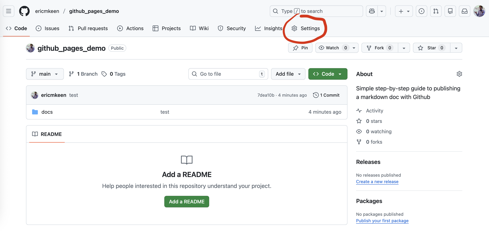
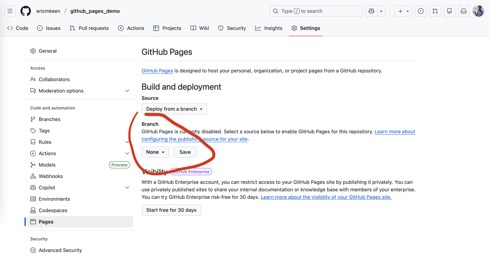
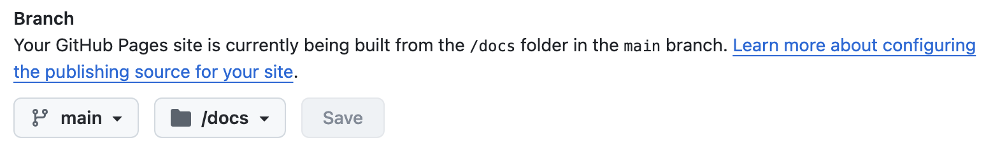
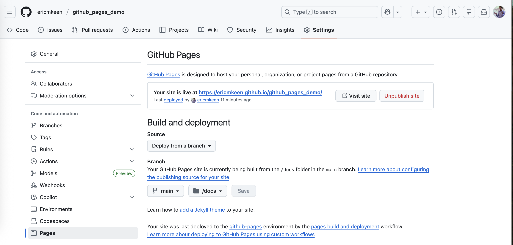
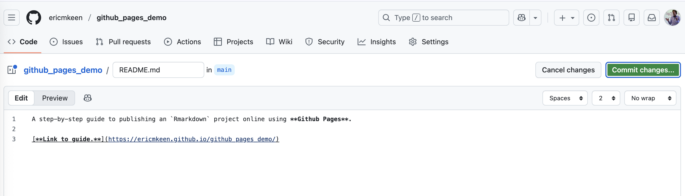
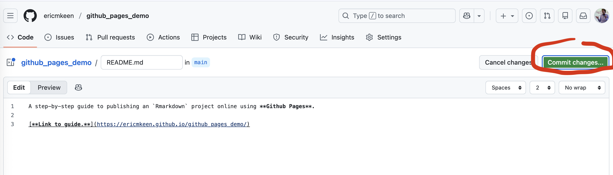

```{r setup, include=FALSE}
knitr::opts_chunk$set(echo = TRUE)
```

&nbsp; 

### Start a repo with an `Rmd` 

&nbsp; 

**Step 1:** Start a new repo on Github. 

**Step 2:** Clone your new repo onto your local machine.   

**Step 3:** In your repo, create a folder named "`docs`".  

**Step 4:** In `RStudio`, start a new `RMarkdown` file. Save it in your repo's "`docs`" folder with the name "`index.Rmd`".   

**Step 5:** Give your `Rmarkdown` doc a title, then add the phrase *"Under construction!"*  

**Step 6:** **Knit** your Rmarkdown file. There should now be a file in your "`docs`" file with the name "`index.html`".

**Step 7:** In Terminal, commit these changes to your repo and push them to the main branch. 

&nbsp; 

### Setup Github Pages 

&nbsp; 

**Step 8:** Back on Github online, go to your repo and click on click on "Settings". 



&nbsp; 

**Step 9:** In Settings, click on "Pages".


&nbsp; 

**Step 10:** Under "Branch", use the first drop-down menu to choose your repo's "`main`" branch, and the second drop-down menu to choose your repo's "`docs`" folder. Click "Save" next to those drop-downs. 



&nbsp; 

**Step 11:** You should see the text under the "Branch" header change to something like this: 



&nbsp; 

**Step 12:** Check back in 10 minutes. The page should now look something like this:  



&nbsp; 

**Step 13:** Click on the new link provided to you by Github to see your `RMarkdown` file live online!  

&nbsp; 

### Post your link!

&nbsp; 

**Step 14:** Copy that link and go back to your repo's main pageby clicking the "`< Code >`" tab. 

**Step 15:** At the bottom of the page you should see an option to "Add a `README`". Click on it.  

**Step 17:** A blank editable `Markdown` file will appear. Write a brief description of what your repo is about, add a blank line, then write "Link to vignette." Make this text bold, then make it into a hyperlink that takes visitors to the link you copied.



&nbsp; 

**Step 18:** Save the changes to your `README` by clicking "Commit Changes": 



&nbsp; 

**Done!** 
Your main repo page is now showing your updated `README` file.  

You can now share your project by sharing either the link to your repo or the direct link to your Github Pages link!  

&nbsp; 

### Updating your webpage

&nbsp; 

Your project is "live", but you can always update it the same way you would any repo:  

- Make changes on your local machine  
- Re-`Knit` your `RMarkdown` file,  
- In Terminal, `add`-`commit`-`push` those changes.  
- Repeat until your project is polished.   

Every time you push a new version of your repo, your Github Pages link will update with the latest version of your `index.html` file. (It usually takes 5 to 10 minutes for your page online to update.) 

&nbsp; 
&nbsp; 


